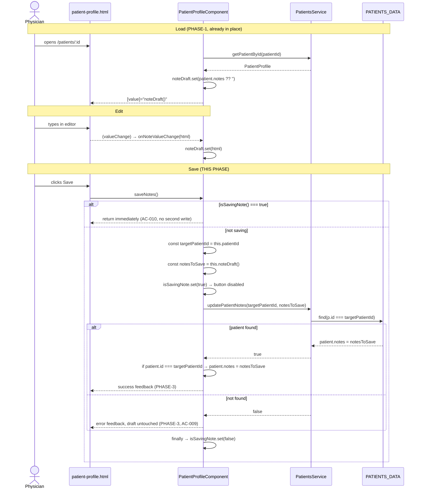

# PHASE-2 — Save Wiring, In-Flight Guard and Stale-ID Safety

| Field | Value |
| --- | --- |
| Phase ID | PHASE-2 |
| Depends on | PHASE-1 (all tasks complete and validated) |
| Blocks | PHASE-3, PHASE-4 |
| Acceptance criteria covered | AC-001, AC-002, AC-003, AC-004, AC-010, AC-012 |
| Files modified | `src/app/patients/patient-profile/patient-profile.ts`, `src/app/patients/patient-profile/patient-profile.html` |

## 1. Objective

Make the Save button actually persist. Replace the `console.log` stub with a real `PatientsService.updatePatientNotes()` call that snapshots its inputs at click time and refuses to run concurrently.

## 2. Save Flow



**Legend** — The `alt` on `isSavingNote()` is the double-submit guard (AC-010). The two `const` snapshots are the stale-id guard. The `finally` reset guarantees the button can never be stranded disabled. Steps labelled "(PHASE-3)" are stubs in this phase and are filled in next.

## 3. Tasks

### TASK-007 — Declare the `isSavingNote` signal

**File:** `src/app/patients/patient-profile/patient-profile.ts`

Locate this exact line (added in PHASE-1 TASK-002):

```ts
  public noteDraft = signal<string>('');
```

Insert immediately **after** it:

```ts
  public isSavingNote = signal<boolean>(false);
```

---

### TASK-008 — Implement `saveNotes()`

**File:** `src/app/patients/patient-profile/patient-profile.ts`
**Depends on:** TASK-007

Replace this exact method:

```ts
  public saveNotes(): void {
    console.log('Saving patient notes...');
    // In a real app, save to backend service
  }
```

with:

```ts
  public saveNotes(): void {
    if (this.isSavingNote()) {
      return;
    }

    const targetPatientId = this.patientId;
    const notesToSave = this.noteDraft();

    this.isSavingNote.set(true);

    try {
      const saved = this.patientsService.updatePatientNotes(targetPatientId, notesToSave);

      if (saved && this.patient && this.patient.id === targetPatientId) {
        // Defensive: `updatePatientNotes()` mutates the same object reference
        // returned by `getPatientById()`, so this assignment is redundant today.
        // Keep it so `this.patient.notes` stays in sync even if PatientsService
        // is ever changed to return a defensive copy instead of a shared reference.
        this.patient.notes = notesToSave;
      }
    } finally {
      this.isSavingNote.set(false);
    }
  }
```

Mandatory details, each of which is load-bearing:

- The early `return` when `isSavingNote()` is already `true` is the programmatic double-submit guard (AC-010). It must come before anything else.
- `targetPatientId` and `notesToSave` must be read into `const`s **before** the service call and must be the only values passed to it (AC-010 / rapid-switching edge case).
- There must be **no** truthiness check on `notesToSave`. An empty string is a valid save (AC-004).
- The `this.patient.id === targetPatientId` re-check prevents writing into a different patient's loaded profile.
- `isSavingNote.set(false)` must be in `finally`, not at the end of `try`.
- Delete the `console.log` and the `// In a real app...` comment entirely.
- **Code-review follow-up (Issue #12 auto-fix):** `this.patient.notes = notesToSave` is a defensive, currently-redundant sync write (since `PatientsService` returns shared references). Keep the explanatory comment shown above so a future change to `PatientsService` (e.g. returning defensive copies) doesn't silently reintroduce a desync bug without anyone noticing why this line exists.

---

### TASK-009 — Disable the Save button while a save is in flight

**File:** `src/app/patients/patient-profile/patient-profile.html`
**Depends on:** TASK-007

Replace this exact line (line 122):

```html
        <button kendoButton rounded="full" (click)="saveNotes()">
```

with:

```html
        <button kendoButton rounded="full" [disabled]="isSavingNote()" (click)="saveNotes()">
```

Do not change the button's contents.

---

### TASK-010 — Verify PHASE-2 compiles and lints

**Depends on:** TASK-008, TASK-009

Run, from the repository root:

```bash
npm run lint
npm run build
```

Both must exit with code 0.

## 4. Validation Criteria

| ID | Criterion | How verified |
| --- | --- | --- |
| V2-01 | `npm run lint` exits 0 | TASK-010 |
| V2-02 | `npm run build` exits 0 | TASK-010 |
| V2-03 | No `console.log` remains in the component | `grep -c "console.log" src/app/patients/patient-profile/patient-profile.ts` returns 0 |
| V2-04 | `updatePatientNotes` is called exactly once in the component | `grep -c "updatePatientNotes" src/app/patients/patient-profile/patient-profile.ts` returns 1 |
| V2-05 | `patients.service.ts` is unmodified | `git diff --stat src/app/services/patients.service.ts` produces no output |
| V2-06 | `patients.data.ts` is unmodified | `git diff --stat src/app/data/patients.data.ts` produces no output |

## 5. Manual Smoke Check (optional, not gating)

Run `npm start`. Open a patient profile, edit the note, click Save, navigate to `/patients`, then re-open the same patient. The edited text must be shown. Repeat with the editor fully cleared — the note must come back empty, not reverted to the original text.

## 6. Acceptance Criteria Mapping

| AC | Satisfied by |
| --- | --- |
| AC-001 | TASK-008 — captured content passed to `updatePatientNotes()` for the active `patientId` |
| AC-002 | TASK-008 + PHASE-1 TASK-004 — store is updated, and re-entry re-seeds from the store |
| AC-003 | TASK-008 — a no-change save writes back the identical draft; no corruption path exists |
| AC-004 | TASK-008 — no truthiness gate on `notesToSave` |
| AC-010 | TASK-007, TASK-008 (programmatic guard), TASK-009 (visible guard) |
| AC-012 | Verified by inspection: no route, guard, provider, or network call is added. Confirmed in PHASE-3 TASK-018b. |

## 7. Out of Scope for This Phase

User-visible success/error feedback (PHASE-3) and tests (PHASE-4). A failed save is silently swallowed at the end of this phase — that is expected and is closed out by PHASE-3.
