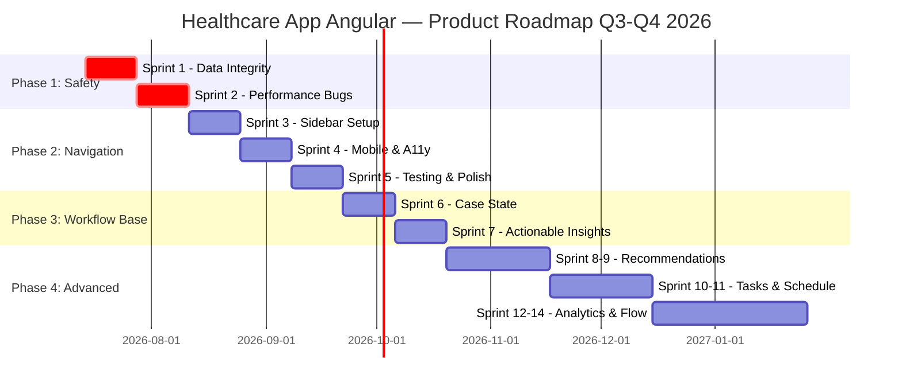
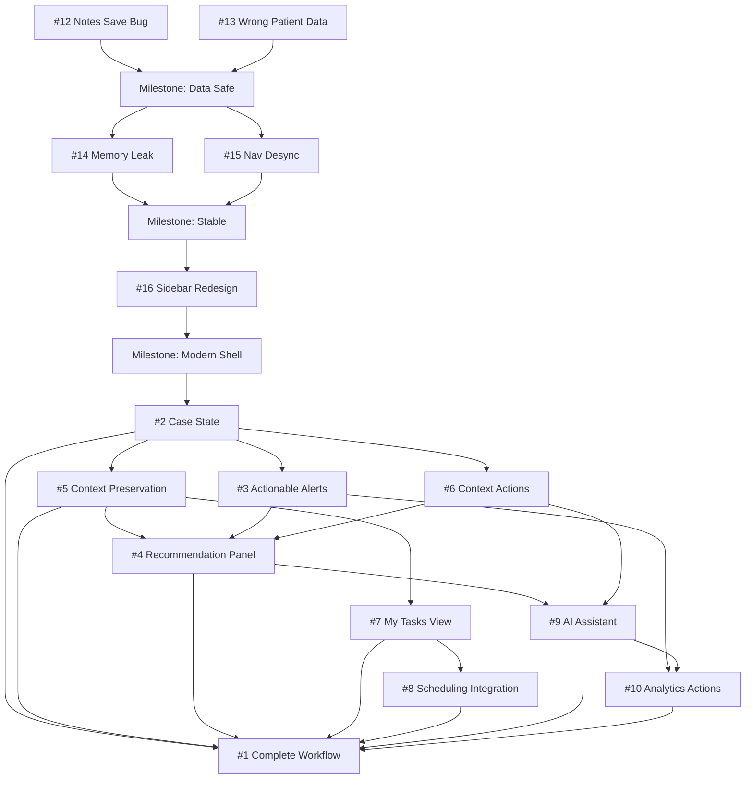

# Product Backlog & Roadmap

## Healthcare App Angular — Strategic Delivery Plan

**Document Version:** 1.0  
**Last Updated:** 2026-07-08  
**Repository:** telerik/healthcare-app-angular  
**Planning Horizon:** Q3-Q4 2026

---

## Executive Summary

This roadmap addresses **15 open issues** spanning critical data integrity bugs, memory leaks, UX/accessibility redesigns, and workflow enhancement features. The backlog is organized into **4 strategic themes** with a phased delivery approach prioritizing patient safety, system stability, and clinical workflow improvements.

### Key Objectives

1. **Eliminate Critical Data Safety Issues** — Fix all silent data loss and patient data mix-ups (P0 priority)
2. **Stabilize Application Performance** — Resolve memory leaks and navigation bugs affecting reliability
3. **Modernize Navigation & Accessibility** — Implement scalable, accessible app shell redesign
4. **Enable End-to-End Clinical Workflows** — Connect analytics, scheduling, and case management into cohesive journeys

### Success Metrics

- **Zero patient data integrity incidents** post-Phase 1 deployment
- **Memory leak elimination** measured by browser profiling over 30-minute sessions
- **Navigation accessibility compliance** (WCAG 2.1 AA)
- **Workflow completion rate** increase by 40% (measured via user testing)

---

## Issue Inventory & Classification

### Total Open Issues: 15

**By Type:**

- Critical Bugs: 4 (Issues #12, #13, #14, #15)
- Major Redesign: 1 (Issue #16)
- Workflow Enhancements: 10 (Issues #1-10)

**By Theme:**

- 🔴 **Data Integrity & Safety:** 2 issues
- 🟡 **Performance & Reliability:** 2 issues
- 🔵 **Navigation & App Shell:** 2 issues
- 🟢 **Clinical Workflow & Integration:** 9 issues

---

## Strategic Themes & Epics

### Epic 1: Data Integrity & Patient Safety 🔴

**Business Value:** Critical — Prevents clinical decision errors and data loss  
**Risk:** High regulatory and safety implications

| Issue | Title                                             | Severity | Estimated Effort |
| ----- | ------------------------------------------------- | -------- | ---------------- |
| #12   | Clinical Notes Are Never Saved (Silent Data Loss) | Critical | 2-3 days         |
| #13   | Wrong Patient Data Shown in Next Patient Dialogs  | Critical | 3-5 days         |

**Dependencies:** None — these are standalone fixes  
**Target Completion:** Sprint 1 (Week 1-2)

---

### Epic 2: Performance & Stability 🟡

**Business Value:** High — Improves system reliability and user experience  
**Risk:** Medium — Affects all users if not addressed

| Issue | Title                                                | Severity | Estimated Effort |
| ----- | ---------------------------------------------------- | -------- | ---------------- |
| #14   | paramMap Subscription Memory Leak on Patient Profile | High     | 2-3 days         |
| #15   | Nav Highlight Desyncs on Direct URL Access           | High     | 1-2 days         |

**Dependencies:** Should be fixed before Epic 3 (navigation redesign) to avoid carrying bugs forward  
**Target Completion:** Sprint 2 (Week 3-4)

---

### Epic 3: Navigation & Accessibility Modernization 🔵

**Business Value:** High — Improves scalability, UX, and compliance  
**Risk:** Medium-High — Significant UI change requires careful testing

| Issue | Title                                                      | Type           | Estimated Effort |
| ----- | ---------------------------------------------------------- | -------------- | ---------------- |
| #16   | Replace Top Navigation with Persistent Collapsible Sidebar | Major Redesign | 2-3 weeks        |

**Dependencies:**

- Must complete Epic 2 first (navigation bug fixes)
- Blocks some Epic 4 features (e.g., task badges on nav items)

**Target Completion:** Sprint 3-5 (Week 5-10)

**Key Deliverables:**

- Collapsible left sidebar with keyboard navigation
- Mobile-responsive drawer pattern
- WCAG 2.1 AA compliant
- Badge support for alerts/notifications per section

---

### Epic 4: Clinical Workflow Integration 🟢

**Business Value:** High — Differentiates product, enables end-to-end care delivery  
**Risk:** Medium — Requires cross-feature coordination

**Phase 4A: Foundational Workflow Infrastructure** (Sprint 6-7)

| Issue | Title                                                    | Estimated Effort | Dependencies |
| ----- | -------------------------------------------------------- | ---------------- | ------------ |
| #2    | Introduce patient case state (open/in progress/resolved) | 3-5 days         | None         |
| #5    | Preserve workflow context across navigation              | 3-5 days         | #2           |

**Phase 4B: Actionable Insights & Next Steps** (Sprint 8-9)

| Issue | Title                                              | Estimated Effort | Dependencies |
| ----- | -------------------------------------------------- | ---------------- | ------------ |
| #3    | Make alerts actionable with "next steps"           | 5-7 days         | #2           |
| #4    | Add recommendation panel for next best actions     | 5-7 days         | #2, #5       |
| #6    | Contextualize quick actions based on patient state | 3-5 days         | #2           |

**Phase 4C: Task Management & Scheduling Integration** (Sprint 10-11)

| Issue | Title                                       | Estimated Effort | Dependencies |
| ----- | ------------------------------------------- | ---------------- | ------------ |
| #7    | Introduce "My Tasks / Active Cases" view    | 1 week           | #2, #5       |
| #8    | Integrate scheduling into patient workflows | 1 week           | #7           |

**Phase 4D: Advanced Intelligence & Analytics** (Sprint 12-14)

| Issue | Title                                                                   | Estimated Effort | Dependencies |
| ----- | ----------------------------------------------------------------------- | ---------------- | ------------ |
| #9    | Improve AI assistant with contextual recommendations                    | 2 weeks          | #2, #4, #6   |
| #10   | Connect analytics insights to actionable decisions                      | 1.5 weeks        | #3, #9       |
| #1    | Add complete clinical workflow (alert → diagnosis → action → follow-up) | 2-3 weeks        | All above    |

**Target Completion:** Sprint 6-14 (Week 11-28)

---

## Prioritized Backlog

### Priority Framework

**P0 — Critical (Patient Safety):** Must fix immediately — data integrity, patient mix-ups  
**P1 — High (Stability):** Fixes impacting reliability and user trust  
**P2 — High (Strategic):** Major architectural improvements enabling future growth  
**P3 — Medium (Workflow):** Feature enhancements improving clinical productivity

---

### Sprint-by-Sprint Breakdown

#### **Phase 1: Foundation & Safety** (Weeks 1-4)

**Sprint 1 (Weeks 1-2): Data Integrity Fixes** — P0

- **#12** — Clinical Notes Save Failure _(2-3 days)_ 🔴
- **#13** — Wrong Patient Data in Dialogs _(3-5 days)_ 🔴
- **Milestone:** Zero data integrity incidents in production

**Sprint 2 (Weeks 3-4): Performance & Navigation Bugs** — P1

- **#14** — Memory Leak on Patient Profile _(2-3 days)_ 🟡
- **#15** — Nav Highlight Desync on Direct URL _(1-2 days)_ 🟡
- **Milestone:** Clean memory profiling over 30-minute sessions

---

#### **Phase 2: Navigation Modernization** (Weeks 5-10)

**Sprints 3-5 (Weeks 5-10): Sidebar Redesign** — P2

- **#16** — Replace Top Nav with Collapsible Sidebar _(2-3 weeks)_ 🔵
  - Sprint 3: Design & component setup
  - Sprint 4: Mobile responsiveness & keyboard navigation
  - Sprint 5: Accessibility testing & refinement
- **Milestone:** WCAG 2.1 AA compliance verified, user acceptance testing complete

---

#### **Phase 3: Workflow Foundation** (Weeks 11-14)

**Sprint 6 (Weeks 11-12): Case State Infrastructure** — P3

- **#2** — Patient Case State System _(3-5 days)_ 🟢
- **#5** — Workflow Context Preservation _(3-5 days)_ 🟢
- **Milestone:** State management layer operational

**Sprint 7 (Weeks 13-14): Actionable Insights (Part 1)** — P3

- **#3** — Actionable Alerts with Next Steps _(5-7 days)_ 🟢
- **#6** — Context-Aware Quick Actions _(3-5 days)_ 🟢

---

#### **Phase 4: Advanced Workflows** (Weeks 15-28)

**Sprint 8-9 (Weeks 15-18): Recommendations & Decision Support** — P3

- **#4** — Recommendation Panel _(5-7 days)_ 🟢
- Begin **#9** — AI Assistant Contextual Recommendations _(2 weeks total)_ 🟢

**Sprint 10-11 (Weeks 19-22): Task Management & Scheduling** — P3

- **#7** — My Tasks / Active Cases View _(1 week)_ 🟢
- **#8** — Scheduling Integration _(1 week)_ 🟢

**Sprint 12-14 (Weeks 23-28): Analytics & Unified Workflow** — P3

- Complete **#9** — AI Assistant _(remaining work)_ 🟢
- **#10** — Analytics to Actions _(1.5 weeks)_ 🟢
- **#1** — Complete Clinical Workflow _(2-3 weeks)_ 🟢
- **Milestone:** End-to-end workflow demo complete, ready for pilot

---

## Visual Timeline

---

## Dependency Map

---

## Resource Planning

### Team Allocation Assumptions

**Estimated Team Composition:**

- 2 Frontend Engineers (Angular/TypeScript)
- 1 UX Designer (Phases 2-3)
- 1 QA Engineer (continuous)
- 1 Product Manager (strategic oversight)

### Effort Summary by Phase

| Phase     | Sprints | Duration     | Engineering Effort         | Key Focus           |
| --------- | ------- | ------------ | -------------------------- | ------------------- |
| Phase 1   | 1-2     | 4 weeks      | 3-4 weeks (2 eng)          | Critical bug fixes  |
| Phase 2   | 3-5     | 6 weeks      | 6-8 weeks (2 eng + design) | Navigation redesign |
| Phase 3   | 6-7     | 4 weeks      | 4-5 weeks (2 eng)          | Workflow foundation |
| Phase 4   | 8-14    | 14 weeks     | 16-20 weeks (2 eng)        | Feature integration |
| **Total** | **14**  | **28 weeks** | **29-37 eng weeks**        | **Full backlog**    |

### Bottleneck Analysis

1. **Phase 2 (Navigation Redesign)** — Longest single task, blocks some Epic 4 features
   - **Mitigation:** Begin Phase 3 planning and design work in parallel during Sprint 4-5

2. **Epic 4 Dependencies** — Many features depend on Issue #2 (case state)
   - **Mitigation:** Prioritize #2 immediately after Phase 2, consider smaller MVP version

3. **Issue #1 (Complete Workflow)** — Depends on nearly everything else
   - **Mitigation:** Treat as integration epic, can begin documentation/design earlier

---

## Risk Register

### High-Priority Risks

| Risk ID  | Description                                                           | Impact | Probability | Mitigation Strategy                                                            |
| -------- | --------------------------------------------------------------------- | ------ | ----------- | ------------------------------------------------------------------------------ |
| **R-01** | Critical bugs (#12, #13) discovered in production before fix          | High   | Medium      | Expedite Sprint 1, consider hotfix branch for immediate deployment             |
| **R-02** | Sidebar redesign (#16) introduces regression or breaks existing flows | High   | Medium      | Comprehensive automated testing before/after, phased rollout with feature flag |
| **R-03** | Epic 4 scope creep due to ambiguous "AI integration" requirements     | Medium | High        | Define MVP scope for #9 early, separate "advanced AI" as future phase          |
| **R-04** | Memory leak fix (#14) requires broader architectural changes          | Medium | Medium      | Conduct technical spike in Sprint 2 Week 1, adjust timeline if needed          |
| **R-05** | Dependencies in Epic 4 create serial bottleneck                       | Medium | High        | Parallelize independent features (#8, #10) where possible                      |

### Medium-Priority Risks

| Risk ID  | Description                                                             | Impact | Probability | Mitigation Strategy                                                |
| -------- | ----------------------------------------------------------------------- | ------ | ----------- | ------------------------------------------------------------------ |
| **R-06** | Accessibility testing reveals major issues in sidebar redesign          | Medium | Medium      | Budget extra week in Sprint 5, engage a11y consultant early        |
| **R-07** | Scheduling integration (#8) requires backend API changes not in scope   | Medium | Low         | Clarify API requirements in Sprint 6, coordinate with backend team |
| **R-08** | "My Tasks" view (#7) UX requires multiple iterations with stakeholders  | Low    | High        | Early mockup review in Sprint 6, allocate buffer time              |
| **R-09** | Analytics integration (#10) depends on external data services not ready | Medium | Low         | Use mock data layer, define API contract early                     |

---

## Assumptions

1. **Team Availability:** 2 full-time frontend engineers available for entire 28-week period
2. **No Breaking External Dependencies:** Kendo UI for Angular components remain stable and compatible
3. **Backend API Stability:** Patient data APIs support required CRUD operations without major changes
4. **Vitest Testing Infrastructure:** Current test suite is functional and can be extended for new features
5. **Stakeholder Availability:** Product stakeholders available for Sprint Planning and reviews every 2 weeks
6. **No Major Scope Additions:** No new critical issues or features added mid-flight without reprioritization
7. **Design Resources:** UX designer available for Phase 2 (Sprints 3-5) and ad-hoc for Epic 4 features
8. **Regulatory Compliance:** No new regulatory requirements introduced during development period

---

## Success Criteria & Acceptance

### Phase 1 (Safety & Stability) — Go/No-Go Criteria

- ✅ All P0 bugs (#12, #13) fixed and verified in production
- ✅ Zero new data integrity incidents reported
- ✅ Memory profiling shows no leaks over 30-minute user session
- ✅ Navigation highlights work correctly on all routes

### Phase 2 (Navigation Redesign) — Launch Readiness

- ✅ WCAG 2.1 AA compliance verified by third-party audit
- ✅ Mobile responsiveness tested on iOS/Android (Safari, Chrome)
- ✅ Keyboard navigation fully functional (tab order, shortcuts)
- ✅ User acceptance testing with 5+ clinicians shows positive feedback
- ✅ No increase in navigation-related support tickets

### Phase 3-4 (Workflow Features) — Incremental Value Delivery

- ✅ Case state system tracks open/in-progress/resolved for 100% of patient interactions
- ✅ Workflow completion rate improves by 40% (baseline: user testing pre-Phase 3)
- ✅ "My Tasks" view shows ≤3 second load time with 50+ active cases
- ✅ AI recommendations have ≥70% acceptance rate in pilot testing
- ✅ End-to-end workflow demo passes clinical stakeholder review

---

## Out of Scope (Future Phases)

The following were considered but deprioritized for this roadmap:

1. **Backend Service Rewrite** — Current plan assumes existing APIs are sufficient
2. **Advanced AI/ML Models** — Issue #9 scoped as "contextual recommendations" not deep learning
3. **Multi-Tenant Support** — Not required for current customer base
4. **Mobile Native App** — Responsive web app is sufficient for now
5. **Integration with EHR Systems** — Deferred to 2027 roadmap
6. **Real-Time Collaboration** — Not a current user need
7. **Billing & Insurance Workflows** — Out of scope for clinical workflow focus

---

## Communication & Governance

### Sprint Cadence

- **Sprint Duration:** 2 weeks
- **Sprint Planning:** Monday Week 1 (2 hours)
- **Daily Standups:** 15 minutes (async on Slack acceptable)
- **Sprint Review:** Friday Week 2 (1 hour) — demo to stakeholders
- **Sprint Retrospective:** Friday Week 2 (30 minutes) — team only

### Milestone Reviews

- **End of Phase 1:** Week 4 — Executive review, go/no-go for Phase 2
- **End of Phase 2:** Week 10 — Accessibility audit, stakeholder demo
- **Mid-Phase 4:** Week 18 — Workflow progress check, reprioritize if needed
- **End of Phase 4:** Week 28 — Full roadmap retrospective, 2027 planning

### Escalation Path

- **Technical Blockers:** Engineering Lead → CTO (within 24 hours)
- **Scope Changes:** Product Manager → VP Product (within 48 hours)
- **Critical Bugs:** Immediate escalation to on-call engineer + Product Manager

---

## Revision History

| Version | Date       | Author       | Changes                                          |
| ------- | ---------- | ------------ | ------------------------------------------------ |
| 1.0     | 2026-07-08 | Product Team | Initial roadmap creation based on 15 open issues |

---

## Appendix: Issue Quick Reference

### Critical Path Issues (Must complete in order)

1. **#12, #13** → Data safety fixes (Sprint 1)
2. **#14, #15** → Performance fixes (Sprint 2)
3. **#16** → Navigation redesign (Sprints 3-5)
4. **#2** → Case state foundation (Sprint 6)
5. **#1** → Complete workflow integration (Sprints 12-14)

### Parallelizable Issues (Can work independently)

- **#3, #6** → Both improve actionability, different surfaces
- **#4, #9** → Recommendations can be developed in parallel with AI assistant
- **#7, #8** → Tasks and scheduling are separate features until final integration
- **#10** → Analytics can proceed in parallel with AI work

### High-Value Quick Wins (Low effort, high impact)

- **#15** — Nav highlight fix (1-2 days, improves UX immediately)
- **#6** — Context-aware quick actions (3-5 days, visible value)

---

## Conclusion

This roadmap balances immediate patient safety needs (Phase 1), strategic modernization (Phase 2), and long-term workflow innovation (Phases 3-4). The 28-week timeline is ambitious but achievable with focused execution and careful dependency management. Regular milestone reviews and risk mitigation will be critical to success.

**Next Steps:**

1. Secure executive approval for roadmap and resource allocation
2. Begin Sprint 1 planning for issues #12 and #13
3. Engage UX designer for Phase 2 planning (sidebar redesign)
4. Schedule technical spike for issue #14 (memory leak investigation)

---

_For questions or roadmap adjustments, contact the Product Management team._
