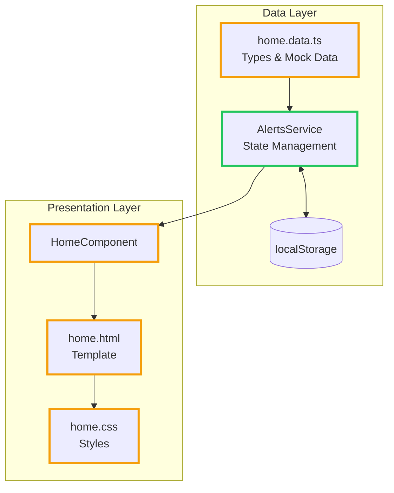

# Implementation Plan: Patient Case State Feature

## Overview

This implementation plan introduces a **Case State** workflow for Daily Alerts on the home dashboard, enabling clinical staff to track alerts through three states: **Open**, **In Progress**, and **Resolved**.

---

## Architecture Summary

**Legend:**

- 🟢 Green border = New file
- 🟠 Amber border = Modified file

---

## Implementation Phases

| Phase | Title                | Description                                         | Dependencies |
| ----- | -------------------- | --------------------------------------------------- | ------------ |
| 1     | Data Model & Types   | Define case state type and extend interfaces        | None         |
| 2     | Alerts Service       | Create service for state management and persistence | Phase 1      |
| 3     | UI - Display State   | Add case state chips to alert list                  | Phase 2      |
| 4     | UI - State Changes   | Implement state change controls in dialog           | Phase 3      |
| 5     | UI - Filtering       | Add filter controls for alerts by state             | Phase 3      |
| 6     | Testing & Validation | Write tests and verify acceptance criteria          | Phase 4, 5   |

---

## Detailed Phase Specifications

See individual phase files for complete implementation details:

- [Phase 1: Data Model & Types](./phase_1.md)
- [Phase 2: Alerts Service](./phase_2.md)
- [Phase 3: UI - Display State](./phase_3.md)
- [Phase 4: UI - State Changes](./phase_4.md)
- [Phase 5: UI - Filtering](./phase_5.md)
- [Phase 6: Testing & Validation](./phase_6.md)

---

## Key Design Decisions

1. **New AlertsService**: Separates state management from UI component
2. **localStorage Persistence**: Demo-appropriate persistence without backend
3. **Kendo Chip Colors**: info (Open), warning (In Progress), success (Resolved)
4. **ButtonGroup for State Change**: 2-click interaction meets NFR-004

---

## Risk Mitigations

| Risk                           | Mitigation                                           |
| ------------------------------ | ---------------------------------------------------- |
| UI clutter                     | Compact chip design; filter reduces visible items    |
| Confusion with clinical status | Distinct blue/amber/green colors; clear labels       |
| Data loss                      | localStorage persistence with default state fallback |

---

## Success Criteria

- [ ] Case state visible on each alert in the list
- [ ] User can change state to any of the three values
- [ ] State persists across page refresh
- [ ] Filtering works for each state value
- [ ] Visual design is consistent with application style
- [ ] All acceptance criteria from user stories met
