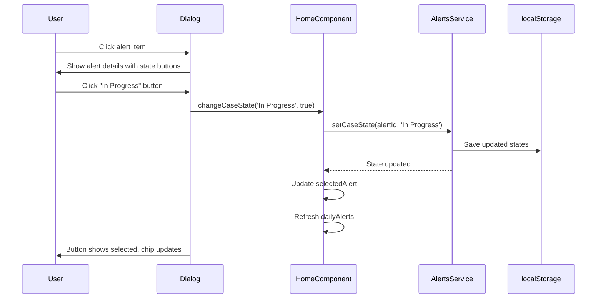

# Phase 4: UI - State Changes

## Objective

Enable clinical staff to change alert case state through the Alert Details dialog using a button group control.

---

## Dependencies

- **Phase 3**: AlertsService injected and case state displayed

---

## Tasks

### TASK-4.1: Add State Change Button Group to Alert Dialog

**File**: `src/app/home/home.html`

**Location**: Inside the Alert Details Dialog, add a new section before the dialog actions (around line 490, before the closing `</div>` of `dialog-content`)

**Current Structure** (abbreviated):

```html
<!-- Alert Details Dialog -->
@if (alertDialogOpened && selectedAlert) {
<kendo-dialog ...>
  <kendo-dialog-titlebar>...</kendo-dialog-titlebar>

  <div class="dialog-content">
    <!-- Patient Information -->
    <div>...</div>
    <!-- Alert Condition -->
    <div>...</div>
    <!-- Lab Values -->
    <div>...</div>
    <!-- Details -->
    <div>...</div>
    <!-- Recommendations -->
    <div>...</div>
    <!-- ADD NEW SECTION HERE -->
  </div>

  <kendo-dialog-actions layout="end">
    <button kendoButton (click)="closeAlertDialog()">Close</button>
    <button kendoButton themeColor="primary" (click)="acknowledgeAlert()">Acknowledge</button>
  </kendo-dialog-actions>
</kendo-dialog>
}
```

**Code to Add** (after Recommendations section, before closing `</div>` of dialog-content):

```html
<!-- Case State -->
<div class="case-state-section">
  <h3 class="field-label">Case State</h3>
  <div class="case-state-controls">
    <kendo-buttongroup selection="single">
      <button
        kendoButton
        [toggleable]="true"
        [selected]="selectedAlert.caseState === 'Open'"
        (selectedChange)="changeCaseState('Open', $event)"
        [themeColor]="selectedAlert.caseState === 'Open' ? 'info' : 'base'"
      >
        Open
      </button>
      <button
        kendoButton
        [toggleable]="true"
        [selected]="selectedAlert.caseState === 'In Progress'"
        (selectedChange)="changeCaseState('In Progress', $event)"
        [themeColor]="selectedAlert.caseState === 'In Progress' ? 'warning' : 'base'"
      >
        In Progress
      </button>
      <button
        kendoButton
        [toggleable]="true"
        [selected]="selectedAlert.caseState === 'Resolved'"
        (selectedChange)="changeCaseState('Resolved', $event)"
        [themeColor]="selectedAlert.caseState === 'Resolved' ? 'success' : 'base'"
      >
        Resolved
      </button>
    </kendo-buttongroup>
  </div>
</div>
```

---

### TASK-4.2: Implement changeCaseState Method in HomeComponent

**File**: `src/app/home/home.ts`

**Location**: Add after `acknowledgeAlert` method (around line 407)

**Code to Add**:

```typescript
public changeCaseState(state: CaseState, selected: boolean): void {
  if (!selected || !this.selectedAlert) {
    return;
  }

  // Update via service
  this.alertsService.setCaseState(this.selectedAlert.id, state);

  // Update local state for immediate UI feedback
  this.selectedAlert = {
    ...this.selectedAlert,
    caseState: state,
  };

  // Refresh the alerts list
  this.dailyAlerts = this.alertsService.alerts();
}
```

---

### TASK-4.3: Update acknowledgeAlert to Set State to In Progress

**File**: `src/app/home/home.ts`

**Location**: Modify existing `acknowledgeAlert` method (around line 402-406)

**Current Code**:

```typescript
public acknowledgeAlert(): void {
  console.log('Alert acknowledged:', this.selectedAlert);
  // Here you would typically update the alert status via a service
  this.closeAlertDialog();
}
```

**Modified Code**:

```typescript
public acknowledgeAlert(): void {
  if (this.selectedAlert && this.selectedAlert.caseState === 'Open') {
    // Acknowledge sets state to In Progress
    this.alertsService.setCaseState(this.selectedAlert.id, 'In Progress');
    this.dailyAlerts = this.alertsService.alerts();
  }
  console.log('Alert acknowledged:', this.selectedAlert);
  this.closeAlertDialog();
}
```

---

### TASK-4.4: Add Styles for State Change Button Group

**File**: `src/app/home/home.css`

**Location**: Add after the case state chip styles added in Phase 3

**Code to Add**:

```css
/* Case State Controls in Dialog */
.case-state-section {
  margin-top: 8px;
}

.case-state-controls {
  display: flex;
  gap: 8px;
}

.case-state-controls .k-button-group {
  flex-wrap: wrap;
}

.case-state-controls .k-button {
  min-width: 100px;
}
```

---

## Interaction Flow



---

## Phase Completion Criteria

| Criterion                      | Verification Method                             |
| ------------------------------ | ----------------------------------------------- |
| Button group renders in dialog | Open alert dialog, see 3 state buttons          |
| Correct button is selected     | Button matching current state appears selected  |
| State change updates UI        | Click different state, button selection changes |
| State persists to localStorage | Change state, check localStorage in DevTools    |
| Alert list updates             | Close dialog, alert chip shows new state        |
| Acknowledge sets In Progress   | Click Acknowledge on Open alert, state changes  |
| Application builds             | `npm run build` succeeds                        |

---

## Manual Test Scenarios

### Scenario 1: Change State to In Progress

1. Open home page
2. Click on alert with "Open" state
3. In dialog, click "In Progress" button
4. **Expected**: Button becomes selected, color changes to amber
5. Close dialog
6. **Expected**: Alert in list shows "In Progress" chip (amber)

### Scenario 2: Mark as Resolved

1. Open alert in "In Progress" state
2. Click "Resolved" button
3. **Expected**: Button selected, color changes to green
4. Close and verify list shows green "Resolved" chip

### Scenario 3: Re-open Resolved Alert

1. Open alert in "Resolved" state
2. Click "Open" button
3. **Expected**: State changes back to Open (blue)

### Scenario 4: Acknowledge Flow

1. Open alert in "Open" state
2. Click "Acknowledge" button
3. **Expected**: Dialog closes, alert state is now "In Progress"

---

## Acceptance Criteria Addressed

| AC ID    | Description                           | Status      |
| -------- | ------------------------------------- | ----------- |
| AC-002-1 | Can mark Open as In Progress          | ✓ Addressed |
| AC-002-2 | Visual indicator reflects In Progress | ✓ Addressed |
| AC-002-3 | In Progress state persists            | ✓ Addressed |
| AC-003-1 | Can mark as Resolved                  | ✓ Addressed |
| AC-003-2 | Resolved styling applied              | ✓ Addressed |
| AC-003-3 | Resolved state persists               | ✓ Addressed |
| AC-005-1 | Can re-open resolved issue            | ✓ Addressed |
| AC-005-2 | Re-opened shows Open styling          | ✓ Addressed |

---

## Rollback Procedure

If issues arise:

1. Remove case-state-section from home.html dialog
2. Remove changeCaseState method from home.ts
3. Revert acknowledgeAlert to original implementation
4. Remove case state control styles from home.css
